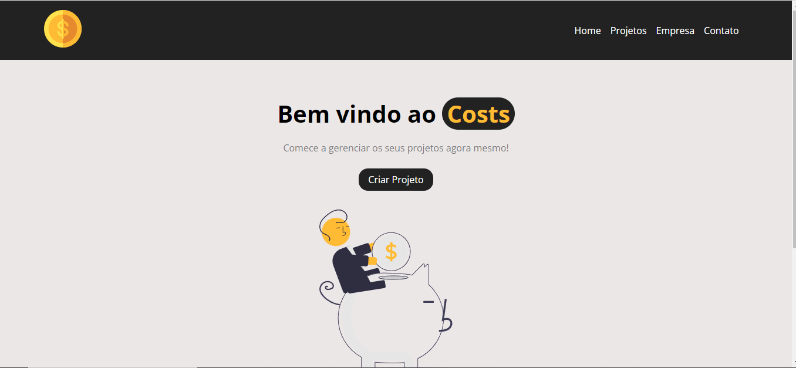
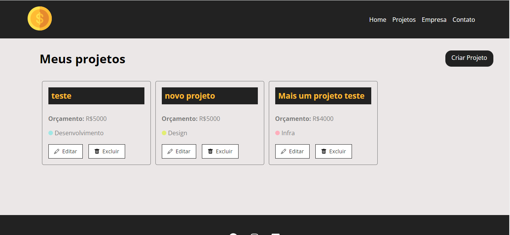
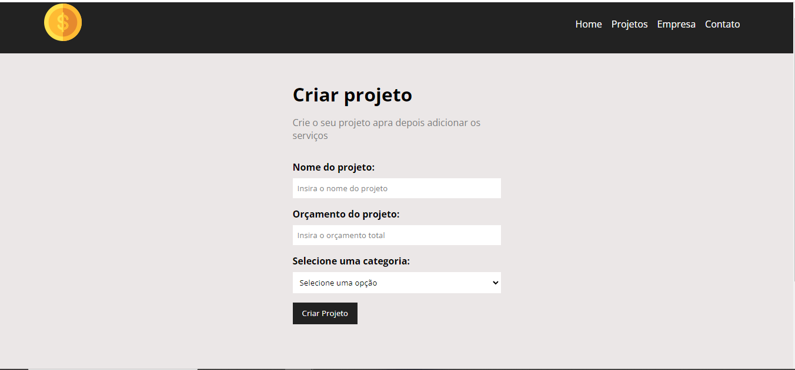
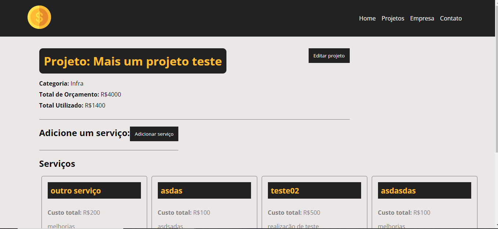
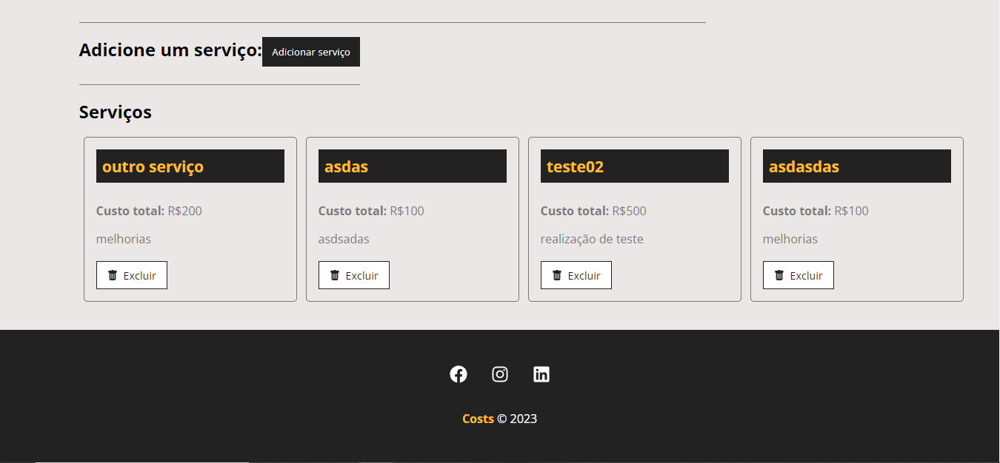
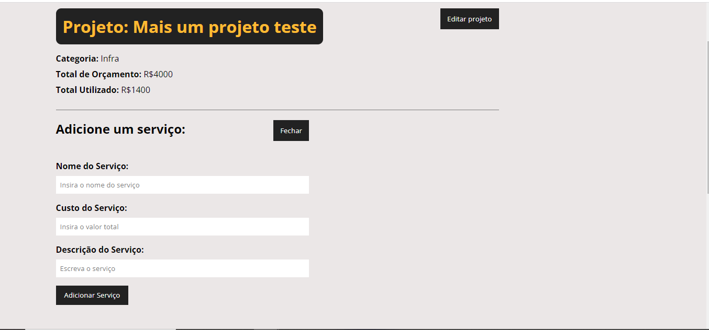

# Sobre
Gerenciador de projetos feito com React permitindo um CRUD completo como: criar, atualizar, deletar e listar projetos que uma empresa pode realizar. É possível estipular um orçamento para o projeto e adicionar serviços para o mesmo. Esse projeto foi feito com base nas aulas do canal Hora de Codar

# Como utilizar
* Instalar a pasta <strong>node_modules</strong>
```bash
npm install
```
* Para simular uma API REST, foi utilizado a biblioteca <b>json-server</b>. Então, inicie o comando:
```bash
npm run backend
```

* Iniciar a aplicação
```bash
npm start
```
# Tecnologias utilizadas
<p>
  <a href="https://skillicons.dev">
    
  </a>
</p>

# Imagens

* Home




* Projetos



* Criar Projetos



* Serviços





** Adicionar serviços ao projeto


